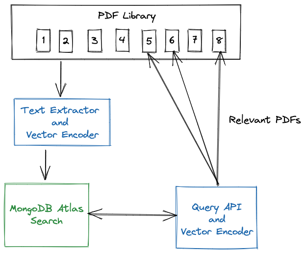

# Atlas Vector Search + GPT Prompt

```
 QUESTION:What steps should banks take to modernize their business?

 ANSWER:

 Banks should take an iterative approach to modernization, using an operational data layer (ODL) as a bridge between their existing systems and new ones. 
 This approach can be broken into five phases: Simple ODL, Data Migration, Application Re-architecture, Application Modernization, and Continuous Improvement. 
 This approach allows banks to offload traffic away from costly mainframe systems, rearchitect monolithic applications into a suite of microservices, build new business functionality faster, and scale new services to millions of users.
```

Using vector-search powered prompt engineering for your favorite LLM


## Inspired by: 
https://github.com/wbleonard/atlas-vector-search-pdf

## Disclaimer:
knnBeta is in early access and should only be used for evaluation purposes only.
https://www.mongodb.com/docs/atlas/atlas-search/knn-beta/

### knnBeta
***This feature is in early access and available only for evaluation purposes, to validate functionality, and to gather feedback from a small closed group of early access users. It is not recommended for production deployments as we may introduce breaking changes. This feature doesn't include formal consulting, SLAs, or technical support obligations.***

## Introduction
This demo is a prototype of how Atlas Vector Search could be used to enhance queries sent to GPT models by providing context relevant to the question.

To begin, the text from the PDFs are extracted, split into chunks, and mapped into a 1024 dimensional dense vector space. The PDF chunks of text along with their vectors are stored into MongoDB Atlas.

An Atlas Vector Search index then allows the PDFs to be queried, finding the PDFs that are relevant to the query. 





### Extract and Encode the PDFs
Install the requirements. This implementation uses:
* [PyPDF2](https://github.com/py-pdf/PyPDF2)    Python library for text extraction
* [pymongo](https://pypi.org/project/pymongo/) - the Python driver for MongoDB
* few others


Run the [encode.py](encode.py)
```python
python3 encode.py
```

### Create Search Index
Create a default search index on the collection:
```json
{
  "mappings": {
    "dynamic": true,
    "fields": {
      "embeddings": {
        "dimensions": 1024,
        "similarity": "cosine",
        "type": "knnVector"
      }
    }
  }
}
```

## Cosine Similarity
https://www.youtube.com/watch?v=e9U0QAFbfLI


## Demo
You are now ready to search your vast PDF library for the PDFs that may hold the answers to your questions.

Your query will be mapped using the same sentence transformer that was used to encode the data and then submitted to Atlas Search, returning the top 3 matches.

For example:

```zsh
✗ python3 query.py 
```

## The Search Query
This is the simple query passed to MongoDB:

```json
[
    {
        "$search": {
            "knnBeta": {
                "vector": <geneated query vector>,
                "path": "embeddings",
                "k": 5  // Number of neareast neighbors (nn) to return 
            }
        }
    },
    {
        "$limit": 5      
    }
]
```

The knnBeta operator uses the [Hierarchical Navigable Small Worlds](https://arxiv.org/abs/1603.09320) algorithm to perform semantic search. You can use Atlas Search support for kNN query to search similar to a selected product, search for images, etc.


